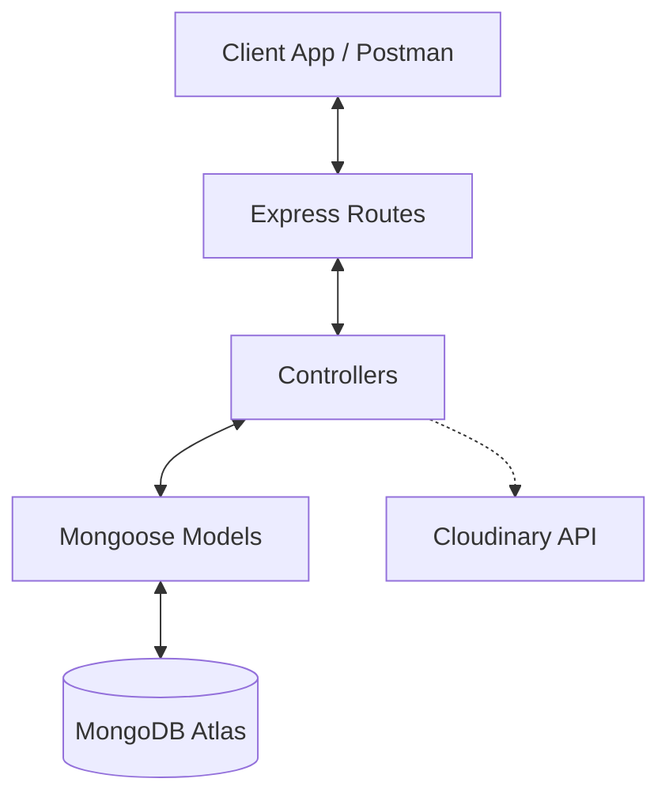

# StudyBudy - Student Notes Sharing Platform Backend

**StudyBudy** is a production-ready MERN stack backend foundation designed for a collaborative student notes sharing platform. It supports storing rich note metadata, tracking analytics (views and downloads), indexing for search, filtering by categories, and handling external storage assets.

---

## 🏗️ Project Architecture

This application is built using the **Model-View-Controller (MVC)** architectural pattern to ensure scalability, clean separation of concerns, and testability.



### Key Components
1. **Routing Layer (`/routes`)**: Maps public URL endpoints to controller functions. It separates user authentication/profile routing from note-sharing logic.
2. **Controller Layer (`/controllers`)**: Implements application business logic. Processes requests, executes database operations, and returns standardized API responses.
3. **Database Layer (`/models`)**: Defines structured schemas with robust built-in validations.
4. **Configuration (`/config`)**: Manages external service connections (MongoDB Atlas, Cloudinary) via environment variables.

---

## 📂 Folder Structure

```
STUDYBUDDY/
├── client/                     # Frontend client workspace (to be implemented)
└── server/                     # Backend server workspace
    ├── config/
    │   ├── db.js                 # MongoDB Mongoose connection
    │   └── cloudinary.js         # Cloudinary configuration (retained for asset storage)
    ├── controllers/
    │   ├── noteController.js     # Notes CRUD, search, filter, and download handlers
    │   └── user.controller.js    # User authentication & registration controllers
    ├── middleware/
    │   └── upload.js             # Multer upload filters and validations (for local uploads)
    ├── models/
    │   ├── Note.js               # Notes Schema (title, subject, semester, pdfUrl, etc.)
    │   └── user.model.js         # User Schema (username, email, password)
    ├── routes/
    │   ├── noteRoutes.js         # Note sharing endpoints
    │   └── user.routes.js        # User auth endpoints
    ├── .env.example              # Environment variables template
    ├── .gitignore                # Server-level file exclusions (temp/, node_modules)
    ├── package.json              # Backend packages and scripts
    └── server.js                 # Main server configuration and initialization
```

---

## 🛢️ Database Design

### Note Schema (`Note.js`)
Stores metadata of student notes, including counts for analytics and links to external files:

| Field Name | Type | Required | Default | Description |
| :--- | :--- | :---: | :---: | :--- |
| `title` | String | Yes | - | Title of the note (trimmed) |
| `description`| String | Yes | - | Brief overview of the content (trimmed) |
| `subject` | String | Yes | - | Subject/course name (trimmed) |
| `semester` | Number | Yes | - | Semester number |
| `branch` | String | Yes | - | Department/Branch (e.g. CSE, AI & ML) |
| `university` | String | Yes | - | Name of college/university (trimmed) |
| `pdfUrl` | String | Yes | - | Direct URL to hosted PDF note |
| `pdfPublicId`| String | No | `""` | Optional Cloudinary public ID |
| `thumbnailUrl`| String | No | `""` | Optional thumbnail preview URL |
| `thumbnailPublicId`| String| No| `""` | Optional thumbnail Cloudinary public ID |
| `uploadedBy` | String | No | `"Admin"`| Creator or uploader name |
| `downloads` | Number | No | `0` | Click tracking counter for downloads |
| `views` | Number | No | `0` | Click tracking counter for views |

---

## 📡 API Endpoints Reference

### Notes Endpoints (`/api/notes`)

* **Upload Note**
  * **Endpoint:** `POST /api/notes/upload`
  * **Payload (JSON):**
    ```json
    {
      "title": "Data Structures Unit 2",
      "description": "Notes on Trees and Graphs",
      "subject": "Data Structures",
      "semester": 3,
      "branch": "CSE",
      "university": "RGPV",
      "pdfUrl": "https://example.com/notes/dsa_unit2.pdf",
      "thumbnailUrl": "https://example.com/thumbnails/dsa_unit2.jpg",
      "uploadedBy": "Ansh Raj"
    }
    ```
  * **Success Response (201):**
    ```json
    {
      "success": true,
      "message": "Note uploaded successfully",
      "data": { ... }
    }
    ```

* **Get All Notes (Paginated)**
  * **Endpoint:** `GET /api/notes?page=1&limit=10`
  * **Query Params:** `page` (default `1`), `limit` (default `10`)

* **Get Single Note Details**
  * **Endpoint:** `GET /api/notes/:id`
  * **Behavior:** Increments `views` analytical count by `1`.

* **Search Notes (Regex)**
  * **Endpoint:** `GET /api/notes/search?query=DSA`
  * **Behavior:** Case-insensitive search matching `title`, `subject`, or `branch`.

* **Filter Notes**
  * **Endpoint:** `GET /api/notes/filter?semester=3&branch=CSE`
  * **Query Params:** `semester`, `subject`, `branch`, `university`

* **Download Note**
  * **Endpoint:** `GET /api/notes/:id/download`
  * **Behavior:** Increments `downloads` counter by `1` and returns the PDF URL.

* **Delete Note**
  * **Endpoint:** `DELETE /api/notes/:id`
  * **Behavior:** Deletes the record from MongoDB and attempts cleanup in Cloudinary if matching public IDs exist.

---

## ⚙️ Setup & Installation

### Prerequisites
* [Node.js](https://nodejs.org/) (v18+)
* [MongoDB Atlas](https://www.mongodb.com/cloud/atlas) Account

### Local Quickstart

1. **Clone & Navigate:**
   ```bash
   cd server
   ```

2. **Install Dependencies:**
   ```bash
   npm install
   ```

3. **Configure Environment Variables:**
   Create a `.env` file in the `server` directory and paste your connection credentials:
   ```env
   PORT=3000
   
   # Use standard connection string if experiencing node DNS lookup issues
   MONGO_URL=mongodb://<username>:<password>@<shard-host-0>:27017,<shard-host-1>:27017/StudyBuddy?ssl=true&replicaSet=<replset-name>&authSource=admin&retryWrites=true&w=majority
   
   # Cloudinary Credentials (if using files upload endpoints)
   CLOUDINARY_CLOUD_NAME=your_cloudinary_name
   CLOUDINARY_API_KEY=your_api_key
   CLOUDINARY_API_SECRET=your_api_secret
   ```

4. **Run the Development Server:**
   ```bash
   npm run start
   # Or using nodemon
   npx nodemon
   ```

---

## 🔒 Security & Optimization Best Practices

* **DNS Resolution Safety:** Configured standard multi-host MongoDB connection string formats to bypass standard Node.js `querySrv` lookups, solving DNS errors (`ECONNREFUSED`) in local development environments.
* **CORS Middleware:** Secured using CORS policy constraints to handle browser request cross-origins safely.
* **Unified Error Handling:** Embedded a centralized Express global error handler middleware ensuring errors do not leak stack traces to client responses and always follow the `{ success: false, message: "..." }` format.
* **Automatic Temp Cleanup:** Features automated file destruction scripts (`fs.unlinkSync`) inside controller `finally` blocks for endpoints handling local Multer file uploading.
